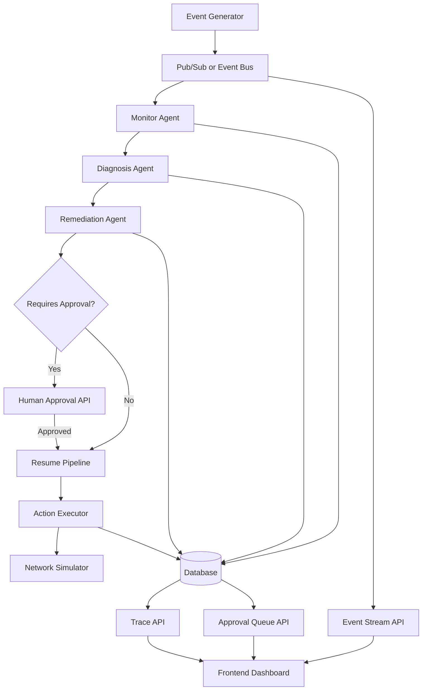

# RootCause AI

RootCause AI is an autonomous network operations system that monitors telecom infrastructure, detects anomalies, diagnoses root causes, and executes remediation actions. It is designed to behave like a real Network Operations Center, but powered by AI agents instead of manual workflows.

The goal of this project is simple. Take raw network signals and turn them into decisions that actually fix problems.

---

## Live Demo

| Service | URL |
|---------|-----|
| Dashboard | [rootcause-ai.vercel.app](https://rootcause-ai.vercel.app) |
| Backend API | [rootcause-backend.onrender.com](https://rootcause-backend.onrender.com) |

> Note: the Render backend is on a free tier — it may take ~30s to wake up on first request.

---

## What this system does

At a high level, the system continuously ingests network events, analyzes them, and decides what to do next.

Each event goes through three stages:

1. Detect if something is wrong
2. Figure out why it is happening
3. Decide how to fix it

If the situation is risky, the system pauses and asks for human approval before taking action.

---

## How it works

The system is built as a multi-agent pipeline.

### Monitor Agent

This is the first step. It looks at raw metrics like latency, packet loss, and throughput. It uses statistical baselines to detect anomalies instead of relying on an LLM.

It assigns:

* an anomaly score
* a severity level
* a short natural language summary of the issue

---

### Diagnosis Agent

Once an anomaly is detected, the system tries to understand the root cause.

It searches a knowledge base of telecom runbooks using semantic retrieval. Then it uses an LLM to reason over the retrieved context and produce a structured diagnosis.

The output includes:

* root cause
* failure type
* confidence score
* supporting evidence

---

### Remediation Agent

Based on the diagnosis, this agent generates a concrete action plan.

Examples:

* reroute traffic
* throttle bandwidth
* restart a node

The system also decides whether the action is safe to execute automatically or should go through approval.

---

## System architecture

Below is the actual flow of how data and decisions move through the system:



---

## What makes this different

This is not just an LLM demo.

* Anomaly detection is statistical, not hallucinated
* Diagnosis is grounded in a real knowledge base
* Actions are executed through real HTTP calls
* Decisions are stored and traceable
* The system can pause and resume safely

The focus is on building a system that behaves like production software.

---

## Running the system

The entire system is containerized. Once the environment variables are configured, everything can be started together.

```bash
docker compose up --build
```

This starts:

* the backend service
* the network simulator
* the event pipeline
* the frontend dashboard

Once running, events begin flowing automatically and the system starts making decisions.

---

## API overview

The backend exposes a small set of endpoints:

* health check to verify system status
* event stream for real time updates
* approval endpoints for human decisions
* trace endpoint to inspect how an event was processed

These endpoints are used by the frontend but can also be called directly.

---

## Observability

Every step in the pipeline is tracked.

You can see:

* which agent made which decision
* how long each step took
* what context was used
* what action was executed

This makes it possible to debug and trust the system.

---

## Why this project exists

Modern infrastructure generates too many signals for humans to handle manually. Most systems still rely on dashboards and alerts that require someone to interpret and act.

This project explores what happens when that entire loop is automated.

Instead of just detecting problems, the system understands them and responds.

---

## Final note

The interesting part is not the model. It is the system around it.

This project is about building something that can observe, reason, and act in a continuous loop. That is where real-world AI systems start to become useful.
